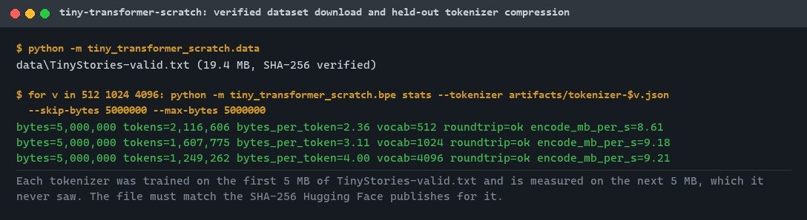
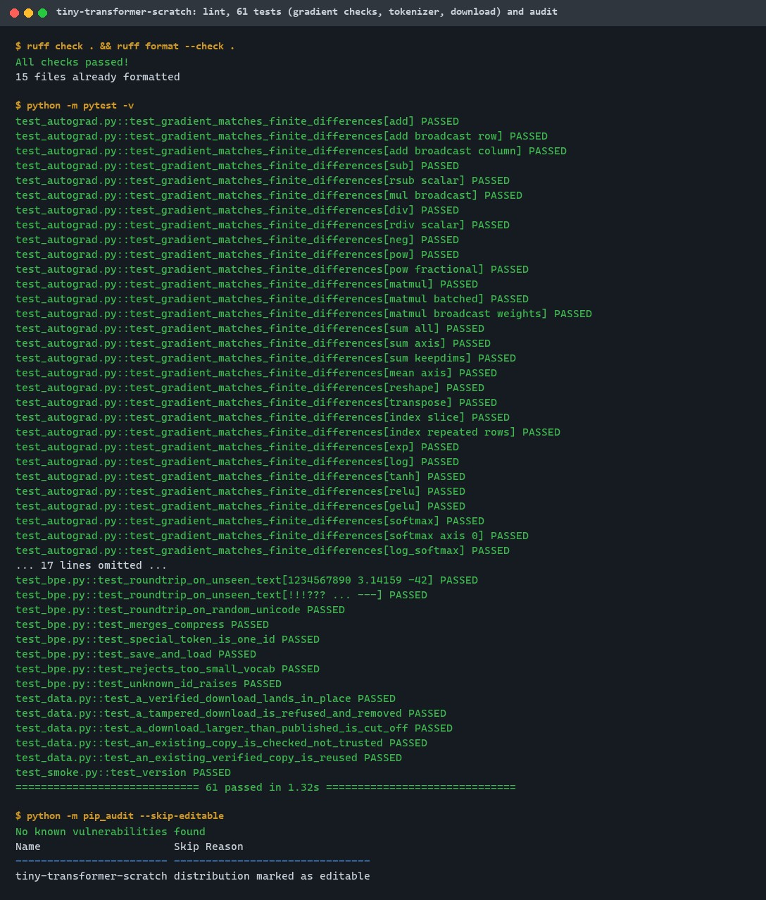
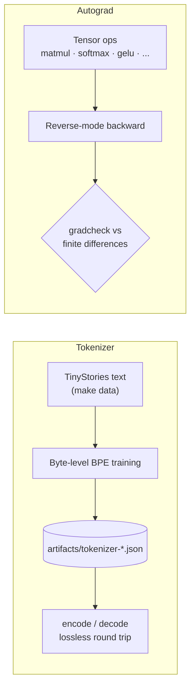
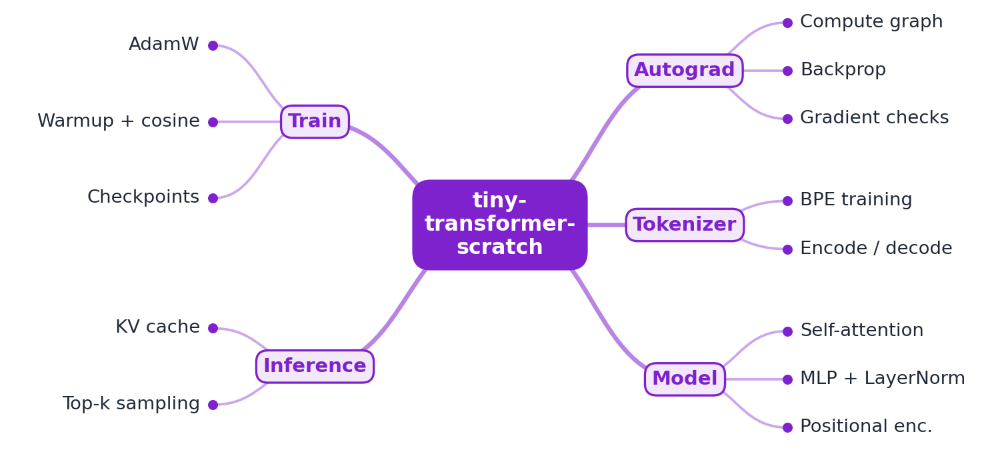
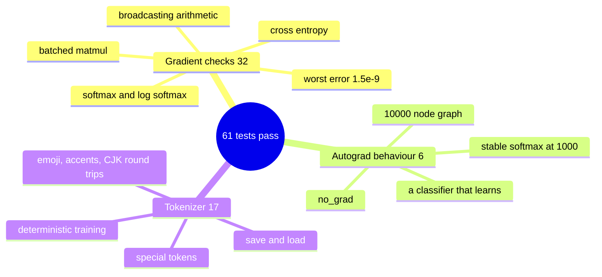
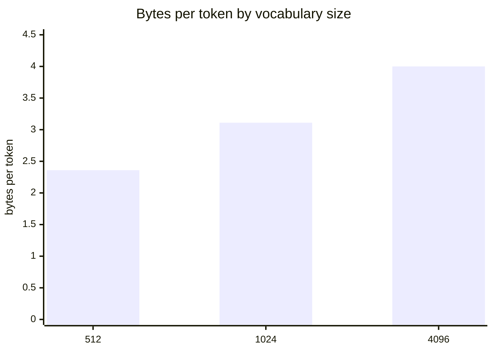

# tiny-transformer-scratch

[](https://github.com/EquinoxWN/tiny-transformer-scratch/actions/workflows/ci.yml)


> Understand how ChatGPT works by building it from scratch, starting at the bottom: a NumPy autograd engine with every gradient checked numerically, and a byte-level BPE tokenizer trained on TinyStories.

Part of my **AI and Machine Learning** list · Python · core project

## Proof it works

The TinyStories file is downloaded from a fixed dataset commit and must match the SHA-256 Hugging Face publishes for it; then each committed tokenizer is measured on 5 MB of text it never saw, losslessly round-tripping every byte. The token counts match the results table exactly:



61 tests pass (gradient checks for every operation, tokenizer, download integrity) and the dependencies have no known vulnerabilities:



## Architecture

**What M1 runs today:**



**Full roadmap (M1 to M3):**



## How it works

_Steps 1 and 2 are built and tested (M1); the rest is on the [roadmap](#roadmap)._

1. A small autograd engine records operations and computes gradients by reverse-mode backprop; finite-difference checks prove each gradient.
2. A byte-pair-encoding tokenizer is trained on the dataset.
3. Transformer blocks (multi-head self-attention, MLP, LayerNorm, residuals) are built on top of the engine.
4. The model trains on TinyStories with AdamW and a warmup + cosine learning-rate schedule.
5. Generation uses a KV cache so each new token does not recompute the whole sequence, with temperature and top-k sampling.
6. The same model is rewritten in PyTorch, and outputs are checked to match.

## Tech stack

| Area | In M1 | Planned |
|---|---|---|
| Core | Python, NumPy autograd written from scratch | Transformer blocks, AdamW training, KV-cache generation, PyTorch reference |
| Data | TinyStories (pinned, SHA-256 checked), byte-level BPE tokenizer | - |
| Test / viz | Finite-difference gradient checks | Loss curves, attention maps |

Language: **Python** with NumPy only (PyTorch arrives in M3 as the parity check).

| Path | What it is |
|---|---|
| `src/tiny_transformer_scratch/autograd.py` | Reverse-mode autograd `Tensor`: arithmetic, matmul, reductions, indexing, activations, softmax, cross-entropy |
| `src/tiny_transformer_scratch/gradcheck.py` | Finite-difference gradient checker |
| `src/tiny_transformer_scratch/bpe.py` | Byte-level BPE tokenizer: train, encode, decode, save, CLI |
| `src/tiny_transformer_scratch/data.py` | Downloads TinyStories from a fixed commit into `data/` (git-ignored) and checks its SHA-256 |
| `artifacts/tokenizer-*.json` | Tokenizers trained on TinyStories (512, 1024, 4096 tokens) |

## Run it

```bash
make setup      # install (NumPy, pytest, ruff)
make test       # gradient checks and tokenizer tests
make data       # download TinyStories-valid.txt (~19 MB) into data/
make tokenizer  # train a 1024-token BPE and measure it on held-out text
make bench      # held-out compression for every committed tokenizer
```

Use it from Python:

```python
from tiny_transformer_scratch.autograd import Tensor, cross_entropy
from tiny_transformer_scratch.bpe import BPETokenizer

tok = BPETokenizer.load("artifacts/tokenizer-1024.json")
ids = tok.encode("Once upon a time, there was a little dog.")
assert tok.decode(ids) == "Once upon a time, there was a little dog."
```

## Tests and results

Latest local run (full detail in [docs/results/m1.md](docs/results/m1.md)):

| Check | Result |
|---|---|
| Test suite | 61 passed, 0 failed |
| Gradient checks vs finite differences | 32 operations, worst error 1.5e-9 (threshold 1e-6) |
| Tokenizer round trip (held-out TinyStories, emoji, CJK, random Unicode) | lossless |
| Compression on 5 MB of held-out TinyStories (vocab 1024) | 3.11 bytes per token |
| Training time, 5 MB of text (vocab 1024) | 1.3 s |

CI re-runs the test suite on every push.

### Test map



Compression on held-out TinyStories text (higher is better):



## Roadmap

**M1** (≈15 h)
- [x] Write `docs/rfc/0001-design.md`: problem, goals, non-goals, chosen design
- [x] A small autograd engine records operations and computes gradients by reverse-mode backprop; finite-difference checks prove each gradient.
- [x] A byte-pair-encoding tokenizer is trained on the dataset.

**M2** (≈20 h)
- [ ] Transformer blocks (multi-head self-attention, MLP, LayerNorm, residuals) are built on top of the engine.
- [ ] The model trains on TinyStories with AdamW and a warmup + cosine learning-rate schedule.

**M3** (≈25 h)
- [ ] Generation uses a KV cache so each new token does not recompute the whole sequence, with temperature and top-k sampling.
- [ ] The same model is rewritten in PyTorch, and outputs are checked to match.
- [ ] Publish the proof below with real numbers

## Proof

What this repo must show before it counts as done:

- Loss curves, sample generations, attention visualisations, and output parity with PyTorch.

| Result | Value |
|---|---|
| M3 proof above | Not measured yet (M3). Current M1 numbers: see [Tests and results](#tests-and-results). |

## Why it matters

- **Interview angle:** 'Explain attention and how an LLM generates text'.
- **Upstream I'd like to contribute to:** PyTorch (Meta) tutorials and docs.

## Design docs

- [RFC 0001: design](docs/rfc/0001-design.md)
- [ADR 0001: record architecture decisions](docs/adr/0001-record-architecture-decisions.md)
- [ADR 0002: NumPy-only engine, gradient checks in float64](docs/adr/0002-float64-gradcheck-and-numpy-only.md)

## Scope

This is a learning and portfolio system, not a hosted production service. Everything runs locally.

## Security and contributing

- Every GitHub Action is pinned to a commit SHA; workflows run read-only, without persisted credentials.
- Dependabot proposes dependency and action updates weekly.
- `ruff` with security (bandit) rules and `ruff format --check` on every push; `pip-audit` (`make audit`) in CI.
- Report vulnerabilities privately: see [SECURITY.md](SECURITY.md). To contribute, see [CONTRIBUTING.md](CONTRIBUTING.md).

## License

MIT, see [LICENSE](LICENSE).
